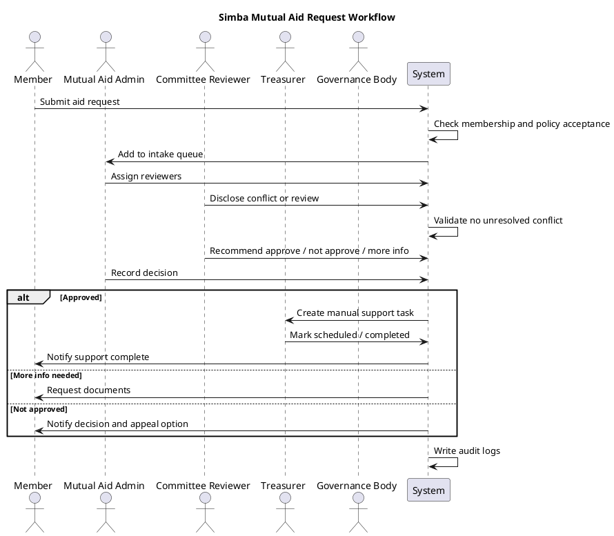

# Simba Mutual Aid Society Technical Spec

**Version:** 0.1  
**Status:** Technical planning document  
**Important:** This technical spec does not authorize live payouts, automated disbursements, production money movement, routes, APIs, migrations, request forms, review queues, dashboards, ledgers, or feature flag runtime logic in Phase 1.

## Technical Goal

Build the Mutual Aid Society in future phases as a controlled platform module that supports fund visibility, contribution tracking, request intake, committee review, approval records, manual support tracking, audit logs, and impact reporting.

The MVP must separate display-only features, contribution record features, request workflow features, review workflow features, manual support recordkeeping, and actual money movement. Actual money movement should remain manual or disabled until governance, professional, accounting, and compliance reviews are complete.

## Feature Flags

All future mutual aid functionality should be controlled by feature flags.

Recommended flags:

```text
MUTUAL_AID_ENABLED
MUTUAL_AID_DISPLAY_ENABLED
MUTUAL_AID_CONTRIBUTIONS_ENABLED
MUTUAL_AID_REQUESTS_ENABLED
MUTUAL_AID_COMMITTEE_REVIEW_ENABLED
MUTUAL_AID_DISBURSEMENT_TRACKING_ENABLED
MUTUAL_AID_PUBLIC_IMPACT_REPORTS_ENABLED
MUTUAL_AID_PAYMENTS_ENABLED
```

MVP default planning values:

```text
MUTUAL_AID_ENABLED=true
MUTUAL_AID_DISPLAY_ENABLED=true
MUTUAL_AID_CONTRIBUTIONS_ENABLED=false
MUTUAL_AID_REQUESTS_ENABLED=false
MUTUAL_AID_COMMITTEE_REVIEW_ENABLED=false
MUTUAL_AID_DISBURSEMENT_TRACKING_ENABLED=false
MUTUAL_AID_PUBLIC_IMPACT_REPORTS_ENABLED=false
MUTUAL_AID_PAYMENTS_ENABLED=false
```

Hard rule: `MUTUAL_AID_PAYMENTS_ENABLED` must remain false until separately approved.

## Module Boundaries

The future Mutual Aid module may connect to users, member profiles, memberships, roles, permissions, audit logs, policy acceptances, notifications, and admin dashboard infrastructure.

The module must not depend on Black Dollar balances, STAR balances, Ownership Contribution Balance, partner reimbursement balances, cash-equivalent wallet behavior, or unrelated financial features. STAR may be shown as participation context only if approved; STAR should not automatically approve aid.

## User Roles

Recommended roles: `member`, `mutual_aid_reviewer`, `mutual_aid_committee_chair`, `mutual_aid_admin`, `mutual_aid_treasurer`, `governance_admin`, and `super_admin`.

### Permission Matrix

- View public overview: all users.
- View member overview: active members.
- Submit request: active members in good standing only if a future phase enables requests.
- Nominate member: active members only if enabled.
- Upload documents: request owner only if enabled.
- View assigned request: assigned reviewer/admin only.
- Recommend decision: assigned reviewer.
- Approve small support: authorized committee role.
- Approve large support: governance admin/board role.
- Create manual support record: mutual aid admin.
- Mark manual support complete: treasurer.
- Edit policy: governance admin.
- View audit logs: admin/treasurer/governance.

## Route Plan

### Member Routes

```text
/mutual-aid
/mutual-aid/rules
/mutual-aid/impact
/mutual-aid/request
/mutual-aid/requests
/mutual-aid/requests/:id
/mutual-aid/nominate
```

### Committee Routes

```text
/admin/mutual-aid/review
/admin/mutual-aid/review/:id
/admin/mutual-aid/conflicts
/admin/mutual-aid/appeals
```

### Admin Routes

```text
/admin/mutual-aid
/admin/mutual-aid/fund
/admin/mutual-aid/contributions
/admin/mutual-aid/requests
/admin/mutual-aid/manual-support
/admin/mutual-aid/policies
/admin/mutual-aid/reports
/admin/mutual-aid/audit
```

MVP first route for a future approved phase: `/mutual-aid`, display-only.

No routes are created in Phase 1.

## API Plan

Future public/member APIs may include overview, rules, impact, my requests, request creation, request detail, document upload, and nominations.

Future committee APIs may include review queue, request detail, conflict disclosure, review submission, request-more-info, and recommendation.

Future admin APIs may include dashboard, fund status, contributions, requests, decision recording, manual support record creation, manual support completion, reports, and audit.

Do not build payout APIs in MVP. No endpoints are created in Phase 1.

## Database Table Draft

Planning-only tables:

```text
mutual_aid_funds
mutual_aid_contributions
mutual_aid_requests
mutual_aid_request_documents
mutual_aid_reviews
mutual_aid_decisions
mutual_aid_manual_support_records
mutual_aid_audit_logs
mutual_aid_policy_versions
mutual_aid_member_acceptances
mutual_aid_conflict_disclosures
mutual_aid_appeals
mutual_aid_request_status_history
mutual_aid_notification_events
mutual_aid_fraud_reviews
mutual_aid_reconciliation_reports
mutual_aid_reserve_rules
mutual_aid_category_budgets
mutual_aid_vendor_recipients
```

No migrations are created in Phase 1.

## Status Machines

Request status:

```text
draft
submitted
eligibility_check
under_review
more_info_requested
committee_recommended
approved
manual_processing_pending
manually_completed
closed
not_approved
withdrawn
expired
flagged
appealed
reversed
```

Manual support status:

```text
pending
scheduled
completed
failed
cancelled
reversed
needs_receipt
closed
```

Contribution status:

```text
pending
confirmed
restricted
refunded
reversed
reconciled
```

## Business Rules

A member may submit a request only if authenticated, active, in good standing, accepted current mutual aid policy, not suspended from mutual aid, within frequency limits, and `MUTUAL_AID_REQUESTS_ENABLED=true`.

A request may be approved only if review requirements are complete, no unresolved conflict exists, fund has available balance, reserve rule is respected, approval authority threshold is satisfied, and audit log is written.

A manual support record may be created only if request is approved, approved amount is greater than zero, recipient details are present, treasurer/admin permission exists, and `MUTUAL_AID_DISBURSEMENT_TRACKING_ENABLED=true`.

Actual payment movement may occur only if `MUTUAL_AID_PAYMENTS_ENABLED=true`, governance approval exists, treasurer confirmation exists, processor integration is approved, and professional review is complete. MVP should not include this.

## Audit Requirements

Write append-only audit logs for request submitted, document uploaded, review assigned, conflict disclosed, status changed, review submitted, decision recorded, manual support record created, manual support marked complete, request closed, appeal submitted, policy accepted, policy changed, fund contribution added, and fund reconciliation completed.

Admins should not be able to silently delete or alter audit records.

## Privacy and Access Rules

Sensitive request details should be visible only to request owner, assigned reviewers, mutual aid admin, authorized governance users, and treasurer for payment-related fields only.

Public impact reports must not expose member name, contact information, address, family details, health details, uploaded documents, private request narrative, committee notes, or payment references.

## First MVP Build Scope

The first future build should include only `/mutual-aid` page, fund purpose, activation threshold, current progress placeholder, rules summary, safe language, coming-soon request flow, admin placeholder only if approved, feature flags, and docs links.

Do not include request form, document uploads, review queue, manual support records, payment processing, member-specific fund amount, or unsafe fund-access wording.

## Testing Requirements

Future unit tests should cover feature flags, permission checks, request status transitions, approval threshold logic, reserve rule logic, conflict blocking, audit log creation, and privacy filtering.

Future integration tests should cover member cannot view another member's request, reviewer cannot review conflicted case, admin can assign reviewer, treasurer can mark manual support complete, unauthorized user cannot access admin routes, and feature flag disables request submission.

Future display tests should verify that UI does not show unsafe language, guaranteed aid language, member-specific fund amount, unsafe fund-access language, or financial-product language.

## PlantUML Workflow



## Required Activation and Safety Guardrails

- Mutual Aid Society is currently **Building Toward Activation**.
- The **$20,000 threshold** must be reached before activation.
- Activation also requires approved policy, governance process, accounting controls, privacy rules, and approval controls.
- There are **no mutual aid distributions before activation**.
- There is **no automatic approval**.
- There are **no guaranteed aid promises**.
- There is **no cash-equivalent wallet balance**.
- There is **no runtime fund movement in this PR**.
- There is **no member-facing application flow yet**.
- There is **no payment, payout, or reimbursement logic in this PR**.
- Live payouts are not authorized by this documentation package.
- Support is reviewed under policy and depends on need, available funds, eligibility, documentation, approval, and committee review.

## Phased Roadmap

1. **Phase 1 — Documentation package.** Create and organize the six documents only.
2. **Phase 2 — Display-only Mutual Aid page.** Future PR only; adds `/mutual-aid` overview page with safe language, activation threshold, coming-soon status, and no request flow.
3. **Phase 3 — Admin/internal planning scaffold.** Future PR only; adds non-public admin planning placeholders if approved. No live requests or payouts.
4. **Phase 4 — Contribution ledger planning/display.** Future PR only; tracks fund progress only if approved. No distributions.
5. **Phase 5 — Request intake pilot.** Future PR only; allowlisted members only. No automatic approval. No automated payouts.
6. **Phase 6 — Committee review pilot.** Future PR only; adds reviewer workflow, conflicts, and decisions.
7. **Phase 7 — Manual disbursement tracking.** Future PR only; records manual payments after governance approval. No automated payments.
8. **Phase 8 — Pilot reporting.** Future PR only; adds anonymized impact and governance reporting.

## Related Mutual Aid Documents

- [SIMBA_MUTUAL_AID_DOCS_INDEX.md](SIMBA_MUTUAL_AID_DOCS_INDEX.md)
- [SIMBA_MUTUAL_AID_SOCIETY_BINDER.md](SIMBA_MUTUAL_AID_SOCIETY_BINDER.md)
- [SIMBA_MUTUAL_AID_SOCIETY_OPERATING_APPENDIX.md](SIMBA_MUTUAL_AID_SOCIETY_OPERATING_APPENDIX.md)
- [SIMBA_MUTUAL_AID_SOCIETY_TECHNICAL_SPEC.md](SIMBA_MUTUAL_AID_SOCIETY_TECHNICAL_SPEC.md)
- [SIMBA_MUTUAL_AID_LANGUAGE_PACK.md](SIMBA_MUTUAL_AID_LANGUAGE_PACK.md)
- [SIMBA_MUTUAL_AID_PILOT_LAUNCH_PLAN.md](SIMBA_MUTUAL_AID_PILOT_LAUNCH_PLAN.md)
