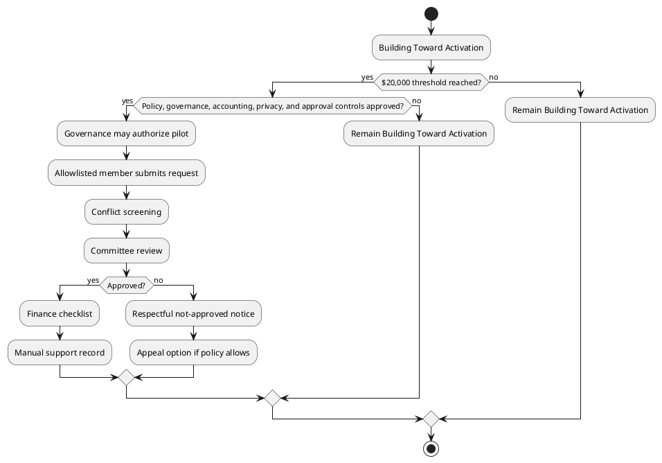

# Simba Mutual Aid Society Technical Spec

**Status:** Developer planning only; no implementation in Phase 1.

## Technical Goal

Plan a future Mutual Aid Society module that preserves policy guardrails, privacy, auditability, and separation from unrelated Simba value lanes.

## Feature Flags

Future flags may include `mutualAidOverviewEnabled`, `mutualAidAdminPlanningEnabled`, `mutualAidFundProgressEnabled`, `mutualAidPilotIntakeEnabled`, `mutualAidCommitteeReviewEnabled`, and `mutualAidReportingEnabled`. Phase 1 adds no runtime feature flag logic.

## Module Boundaries

Future code should isolate mutual aid display, request intake, committee review, accounting checklist, manual support records, and reporting. It must not modify STAR, Black Dollars, ownership contribution progress, partner reimbursements, or wallet runtime logic unless a later phase explicitly approves a narrow integration.

## User Roles

Draft roles: member, intake reviewer, committee reviewer, finance reviewer, privacy steward, governance liaison, administrator, auditor.

## Route Plan

Future route ideas: `/mutual-aid`, `/mutual-aid/status`, `/admin/mutual-aid/planning`, `/admin/mutual-aid/requests`, and `/admin/mutual-aid/reports`. No routes are created in Phase 1.

## API Plan

Future API groups may cover status display, request intake, review assignment, decision recording, recusal recording, accounting checklist, and aggregate reporting. No endpoints are created in Phase 1.

## Database Table Draft

Draft tables: `mutual_aid_policy_versions`, `mutual_aid_fund_snapshots`, `mutual_aid_requests`, `mutual_aid_request_documents`, `mutual_aid_review_assignments`, `mutual_aid_decisions`, `mutual_aid_recusals`, `mutual_aid_accounting_checklists`, `mutual_aid_manual_support_records`, `mutual_aid_appeals`, and `mutual_aid_aggregate_reports`. No migrations are created in Phase 1.

## Status Machines

Activation status: `building_toward_activation`, `ready_for_governance_review`, `activated_for_pilot`, `paused`, `closed`.

Request status after activation: `draft`, `submitted`, `needs_information`, `under_review`, `conflict_review`, `finance_review`, `approved_for_manual_processing`, `not_approved`, `appealed`, `closed`.

## Business Rules

- Block all request intake until activation and phase approval.
- Require non-guarantee acknowledgment.
- Require conflict screening before decisions.
- Require finance review before any manual support record.
- Prevent self-review and self-approval.
- Keep aggregate reporting privacy-safe.

## Audit Requirements

Log policy version, actor, role, timestamp, status changes, decision rationale code, conflict disclosure, recusal, finance checklist completion, corrections, and report generation.

## Privacy and Access Rules

Use least-privilege access, separate sensitive request details from aggregate reports, redact documents from unauthorized views, and define retention before launch.

## First MVP Build Scope

The first future MVP after documentation should be display-only status. Request intake, review, accounting, manual support records, and reporting require later phase approval.

## Testing Requirements

Future tests should cover activation gates, role access, conflict recusals, status transitions, non-guarantee language, audit logs, privacy redaction, and separation from STAR, Black Dollars, ownership contribution progress, partner reimbursements, and wallet runtime logic.

## PlantUML Workflow

## Required Activation Guardrails

- Mutual Aid Society is currently **Building Toward Activation**.
- The **$20,000 threshold** must be reached before activation.
- Activation also requires approved policy, governance process, accounting controls, privacy rules, and approval controls.
- There are **no mutual aid distributions before activation**.
- Support is reviewed support, not guaranteed support.
- There is no automatic approval.
- There is no cash-equivalent member balance.
- There is no runtime fund movement in this Phase 1 documentation PR.
- There is no member-facing application flow yet.
- There is no payment, payout, or reimbursement logic in this PR.

## Phased Roadmap

1. **Phase 1 — Documentation package.** Create and organize the six documents only.
2. **Phase 2 — Display-only Mutual Aid page.** Future PR only; adds `/mutual-aid` overview page with safe language, activation threshold, coming-soon status, and no request flow.
3. **Phase 3 — Admin/internal planning scaffold.** Future PR only; adds non-public admin planning placeholders if approved, with no live requests or payouts.
4. **Phase 4 — Contribution ledger planning/display.** Future PR only; tracks fund progress only if approved, with no distributions.
5. **Phase 5 — Request intake pilot.** Future PR only; allowlisted members only, no automatic approval, and no automated payouts.
6. **Phase 6 — Committee review pilot.** Future PR only; adds reviewer workflow, conflicts, and decisions.
7. **Phase 7 — Manual disbursement tracking.** Future PR only; records manual payments after governance approval, with no automated payments.
8. **Phase 8 — Pilot reporting.** Future PR only; adds anonymized impact and governance reporting.

## Related Mutual Aid Documents

- [SIMBA_MUTUAL_AID_DOCS_INDEX.md](SIMBA_MUTUAL_AID_DOCS_INDEX.md)
- [SIMBA_MUTUAL_AID_SOCIETY_BINDER.md](SIMBA_MUTUAL_AID_SOCIETY_BINDER.md)
- [SIMBA_MUTUAL_AID_SOCIETY_OPERATING_APPENDIX.md](SIMBA_MUTUAL_AID_SOCIETY_OPERATING_APPENDIX.md)
- [SIMBA_MUTUAL_AID_SOCIETY_TECHNICAL_SPEC.md](SIMBA_MUTUAL_AID_SOCIETY_TECHNICAL_SPEC.md)
- [SIMBA_MUTUAL_AID_LANGUAGE_PACK.md](SIMBA_MUTUAL_AID_LANGUAGE_PACK.md)
- [SIMBA_MUTUAL_AID_PILOT_LAUNCH_PLAN.md](SIMBA_MUTUAL_AID_PILOT_LAUNCH_PLAN.md)
