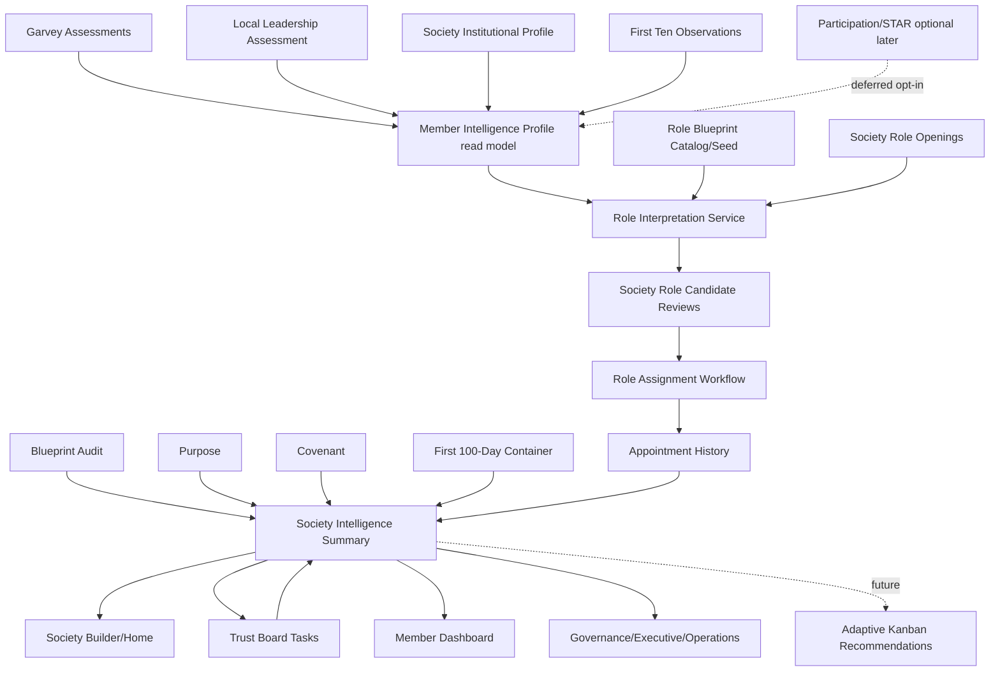
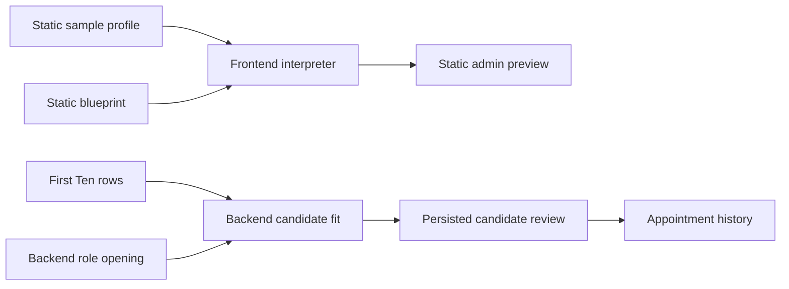
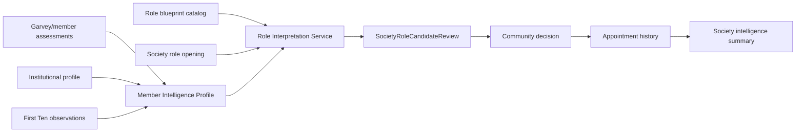
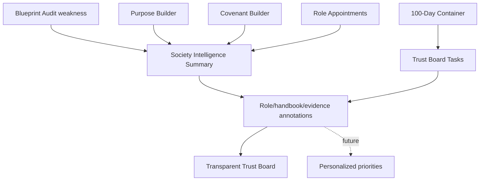

# Repo-Wide Unified Intelligence Layer Roadmap

Date: 2026-06-30  
Status: architecture and implementation roadmap; no runtime behavior changed.  
Intent: connect existing Society Builder, Member Intelligence, assessments, role workflows, dashboards, containers, and governance systems before introducing adaptive features.

## 1. Complete repository architecture map

| Layer | Existing systems | Primary files | Current role |
|---|---|---|---|
| Platform shell and routing | App routes, auth gates, global navigation | `src/App.jsx`, `src/components/GlobalNav.jsx`, `src/authz.js` | Routes members/admins into dashboards, Society Builder, assessments, mutual aid, library, preparedness, and deferred modules. |
| Identity and authorization | Users, profiles, RBAC roles/permissions, subscriptions | `backend/app/models.py`, `backend/app/authz.py`, `backend/app/routes/auth.py`, `backend/app/services/billing.py` | Defines platform account identity and app permissions; must remain separate from society responsibilities. |
| Society operating system | Society registry, memberships, chapter hierarchy, foundation workflows | `backend/app/models.py`, `backend/app/routes/society_builder.py`, `backend/app/services/society_builder.py`, `src/api/societyBuilder.js`, Society Builder pages | Best existing spine for local institution context and society lifecycle. |
| Member intelligence inputs | Garvey sync/events, member profile attributes, local leadership assessment, onboarding, institutional profile | `backend/app/routes/garvey.py`, `backend/app/routes/assessment.py`, `backend/app/routes/member.py`, `backend/app/models.py`, `src/api/assessments.js` | Stores assessment/growth evidence and member-stated contribution/need/growth data, but not yet joined into Society Builder role decisions. |
| Role intelligence | Static role blueprints, static member samples, static interpreter, persisted role assignment workflow | `src/data/mutualAidRoleBlueprints.js`, `src/data/memberBehavioralProfiles.js`, `src/data/roleInterpretationEngine.js`, `backend/app/routes/society_builder.py`, `backend/app/models.py` | Two parallel systems exist: frontend/static preview and backend/persisted society workflow. They should converge through one service. |
| Container and Kanban work execution | First 100 Days container, milestones, trust-board tasks, handbook references | `SocietyContainer`, `SocietyContainerMilestone`, `SocietyTrustTask`, `src/pages/SocietyTrustBoardPage.jsx`, `src/pages/First100DaysChapterReaderPage.jsx`, `src/data/societyContainerGuide.js` | Existing Kanban/task source of truth. Adaptive behavior should annotate/recommend through this board, not replace it. |
| Mutual Aid fund operations | Requests, reviews, decisions, appeals, disbursements, budgets, reconciliation, security, analytics | `backend/app/routes/mutual_aid.py`, MutualAid models, `src/api/mutualAidRequests.js`, mutual aid admin/member pages | Operational fund runtime. It is not yet society-scoped and should not be treated as local society treasury until explicitly associated. |
| Participation and STAR | Activities, points, rewards, reputation, leaderboards, verification, v2 ledger | `backend/app/services/participation.py`, `backend/app/routes/participation.py`, `src/api/participation.js`, `src/v2-ledger/*` | Potential future evidence stream; should be opt-in and summarized, never a punitive reputation source for roles. |
| Knowledge commons | Audiobook/library, handbook, reflections, study reader, organizer | `backend/app/routes/audiobook.py`, audiobook models, `src/pages/StudyPage.jsx`, `src/data/containers/*` | Source of learning evidence and handbook references for tasks/roles. |
| Admin dashboards and governance surfaces | Admin operations, executive analytics, governance center, chapter review, readiness/security dashboards | `src/pages/AdminOperationsDashboard.jsx`, `src/pages/MutualAidExecutiveDashboard.jsx`, `src/pages/MutualAidGovernanceCenter.jsx`, `src/pages/SocietyChapterAdminPage.jsx` | Mixed live and static planning surfaces. They should consume aggregate intelligence, not compute separate recommendations. |

## 2. Current integration/dependency map

| Existing system | Current data sources | Outputs | Consumers | Missing connections |
|---|---|---|---|---|
| Society Builder | `Society`, `SocietyMembership`, current user | Society records, chapter status, membership | Society Home, My Societies, Chapter Admin, Member Home | Does not expose unified intelligence summary or role coverage on main society surfaces. |
| Blueprint Audit | user-entered maturity scores | weakest/strongest area, recommended next step | Society Home summary | Does not generate Trust Board recommendations, role openings, or container task emphasis. |
| Purpose Builder | structured purpose payload | persisted purpose statement/refinement prompt | Society Home, stage eligibility | Does not feed role requirements, Day 100 targets, dashboards, or task prioritization. |
| Covenant Builder | covenant text/commitments | persisted covenant version/status | Society Home, stage eligibility | Does not feed governance role needs, conflict/recordkeeping training, or policy dashboards. |
| First Ten | manual member details, scores, optional `user_id` | candidate pool and summary | Society Home, backend role candidate suggestions | Optional linked users do not pull Garvey/member profile evidence; First Ten does not prompt assessment completion. |
| Institutional Profiles | society-scoped profile fields | contribution/needs/goals directory | Member Home, Directory, admin profile read | Not used by role-fit, mentor recommendations, role coverage, or care workflows. |
| Role Assignment Workflow | role openings + First Ten rows | reviews, discussion notes, appointments | backend API only | Missing frontend API client/page; not connected to role blueprints or Garvey evidence. |
| Role Blueprint Library | static JS blueprint data | role catalog and admin preview | Role Blueprint page, static role review | Not seeded into backend `SocietyRoleOpening`; duplicate with free-text backend openings. |
| Static Role Interpreter | static blueprints + sample profiles | fit narratives/growth suggestions | static Mutual Aid role review page | Parallel recommendation engine; should become server-side/shared adapter feeding persisted reviews. |
| Garvey Assessments | external assessment callbacks, member assessment APIs | sync events, growth profile attributes, completion summaries | Assessment Center, Member Dashboard, admin diagnostics | Not consumed by Society Builder, Role Assignment, Trust Board, or institutional profiles. |
| Local Leadership Assessment | local questions/results | leadership scores/results dashboard | legacy leadership UI/admin analytics | Not normalized into unified evidence contract. |
| First 100-Day Container | Society, handbook/task templates | active container, milestones, tasks, progress | Trust Board, Society Home | Does not incorporate blueprint weaknesses, role coverage, or assessment-derived readiness. |
| Trust Board/Kanban | `SocietyTrustTask`, container milestones | task lanes/statuses/owners/reader references | Society Trust Board | `linked_role` is present but does not connect to openings/reviews/appointments. |
| Handbook/Reader | static guide + audiobook chapters | learning sections and reader links | Trust Board reader reference, Study | Role blueprint handbook references are not normalized to active task/reader keys. |
| Governance/Executive/Operations dashboards | static arrays + selected live admin endpoints | readiness/analytics/admin views | admins | Multiple static dashboards duplicate health/readiness logic instead of consuming one intelligence summary. |
| Mutual Aid Fund | fund/request/review/disbursement models | financial controls, request status, analytics | Mutual Aid pages/admins | Not linked to society roles, treasurer appointments, or society-scoped treasury. |
| Participation/STAR | activity/points/rewards/verification | member experience, opportunities, leaderboards | Member Dashboard, STAR pages | Not privacy-gated as role evidence and should remain deferred for role-fit. |

## 3. Unified Intelligence architecture

The architecture should be a read-model/service layer, not a new master database. The central component should be a backend service such as `backend/app/services/member_intelligence.py` that composes existing sources and returns provenance-aware summaries.

Design principles:

1. Society Builder remains the operating system and owns society context.
2. Member Intelligence is a generated profile/read model with provenance and privacy scopes.
3. Role Assignment Workflow remains the persisted decision trail.
4. Trust Board remains the canonical task board.
5. Dashboards consume summaries; they do not run independent recommendation engines.
6. No circular dependency: evidence -> profile -> interpretation -> workflow -> society/task/dashboard summaries.

## 4. Source-of-truth document

| Domain fact | Source of truth | Aggregated into Member Intelligence? | Notes |
|---|---|---|---|
| Platform identity | `User`, `MemberProfile` | Yes | `MemberProfile.attributes` already stores Garvey/growth profile data. |
| App permissions | RBAC `Role`, `UserRole`, `Permission`, `User.role` | No, except permission gating | Never merge with society roles automatically. |
| Society membership | `SocietyMembership` | Yes | Defines local membership context and society role label. |
| First Ten candidate observations | `SocietyFirstTenMember` | Yes | Include only with provenance and linked-user context when available. |
| Member-stated contributions/goals/needs | `SocietyInstitutionalProfile` | Yes | Respect existing visibility and `needs_privacy_level`. |
| Assessment evidence | `GarveySyncEvent`, `MemberProfile.attributes.growth_profile`, `garvey_assessment_completions`, `LeadershipAssessment` | Yes | Raw assessment data stays where it is; role review receives summarized evidence. |
| Role definitions | `src/data/mutualAidRoleBlueprints.js` now; future backend catalog/seed | Indirect | Convert to backend seed/catalog before using in live workflows. |
| Role reviews and appointments | `SocietyRoleOpening`, `SocietyRoleCandidateReview`, `SocietyRoleAppointmentHistory` | Consumes MIP; outputs society responsibility history | This is the decision trail, not the intelligence source. |
| Society maturity | `SocietyBlueprintAudit` | Society summary, not individual MIP | Drives society-level recommendations and role/task needs. |
| Purpose/covenant | `SocietyPurpose`, `SocietyCovenant` | Society summary | Drives mission/rule alignment and role requirements. |
| Active work | `SocietyContainer`, `SocietyContainerMilestone`, `SocietyTrustTask` | Society summary and future Kanban recommendations | Existing task board remains canonical. |
| Mutual Aid fund accounting | MutualAid fund/request/disbursement models | No direct MIP at first | Integrate only through explicit society-fund association and permissions. |
| Participation/STAR | participation/activity/reward models | Later opt-in summary | Never use as ranking/punishment. |

## 5. Existing vs duplicated functionality

| Area | Existing functionality | Duplicate/parallel functionality | Consolidation recommendation |
|---|---|---|---|
| Role recommendations | backend candidate fit in Society Builder role assignment | static `roleInterpretationEngine.js` + sample profiles | Move live interpretation behind one backend/shared service that writes candidate reviews. |
| Member profile | `MemberProfile.attributes`, `SocietyInstitutionalProfile` | `memberBehavioralProfiles.js` sample profiles | Treat static profiles as demo only; build live adapter from existing tables. |
| Role definitions | static role blueprints | free-text role openings | Seed backend openings from blueprints; keep openings editable. |
| Dashboard health | Mutual Aid readiness/executive/operations pages | Society Home summaries and admin operations | Create one society intelligence summary endpoint; dashboards display aggregate slices. |
| Task planning | Trust Board | future adaptive Kanban, role development plans | Keep Trust Board; attach metadata/recommendations to tasks rather than creating a second board. |
| Treasury/ledger | Mutual Aid financial controls, Ledger/v2 ledger | Treasurer role blueprint | Do not merge until society-fund/ledger accounting boundary is designed. |
| Governance rules | Covenant Builder, governance docs pages | static governance dashboards | Covenant is source; dashboards should reference covenant status and review rhythm. |

## 6. Missing API connections

Immediate missing API client/backend exposure:

- `src/api/societyBuilder.js` lacks wrappers for `/role-assignment/dashboard`, open roles, candidate suggestions, reviews, notes, decisions, and appointment history.
- No endpoint returns a unified member intelligence profile for a `(society_id, user_id or first_ten_member_id)` review context.
- No endpoint maps Garvey assessment completions to role blueprint `recommended_assessments`.
- No endpoint seeds `SocietyRoleOpening` records from `mutualAidRoleBlueprints.js`.
- No endpoint returns society role coverage/vacancy summary for Society Home, Trust Board, or dashboards.
- No endpoint annotates Trust Board tasks with linked-role coverage and candidate-review CTAs.
- No society-fund association endpoint exists between Society Builder and Mutual Aid fund runtime.

## 7. Data flow diagrams

### 7.1 Current role review split

### 7.2 Target role review flow

### 7.3 Target task/container flow

## 8. Integration priority matrix

| Priority | Work | Value | Risk | Why now |
|---|---|---:|---:|---|
| P0 | Adopt source-of-truth boundaries in docs | High | Low | Prevents another intelligence island. |
| P1 | Expose existing backend role assignment in frontend API/UI | High | Low | Connects real persisted workflow before new intelligence. |
| P1 | Add role coverage summary endpoint/card | High | Low | Society Builder becomes operating dashboard. |
| P2 | Seed backend role openings from role blueprints | High | Medium | Reuses existing role catalog and reduces duplicate role text. |
| P2 | Build read-only Member Intelligence Profile adapter | High | Medium | Replaces sample behavioral profiles without schema churn. |
| P3 | Map Garvey completions to role recommended assessments | High | Medium | Converts assessments into useful, bounded evidence. |
| P3 | Write live interpretation summaries into candidate reviews | High | Medium | Unifies recommendation engine around persisted workflow. |
| P4 | Annotate Trust Board with role coverage/handbook evidence | Medium | Medium | Improves existing Kanban without adaptive rebuild. |
| P5 | Aggregate governance/executive/ops dashboard summaries | Medium | Medium | Removes static dashboard duplication. |
| P6 | Society-fund/treasury association | High | High | Important but financially sensitive; defer until role/permission model is stable. |
| P7 | Adaptive Kanban personalization | High | High | Requires stable evidence, privacy, and transparent recommendation rationale first. |

## 9. Recommended implementation phases

1. **Phase 0 — Freeze boundaries:** Publish this roadmap and treat Society Builder as the integration spine.
2. **Phase 1 — Use what exists:** Add frontend API/page support for existing role assignment endpoints and appointment history.
3. **Phase 2 — Role catalog seeding:** Create a blueprint seed service/endpoint that imports critical role blueprints into editable role openings.
4. **Phase 3 — Member Intelligence Profile adapter:** Add read-only service from existing MemberProfile, Garvey completions, LeadershipAssessment, institutional profile, and First Ten evidence.
5. **Phase 4 — Live role interpretation:** Replace static sample-role fit with the shared service and persist outputs in candidate reviews.
6. **Phase 5 — Society intelligence summary:** Add endpoint combining role coverage, blueprint gaps, purpose/covenant status, container progress, trust-board blockers, and appointment history.
7. **Phase 6 — Trust Board annotations:** Show linked-role coverage and handbook/practice recommendations on existing cards.
8. **Phase 7 — Dashboard consolidation:** Point executive/operations/governance/member dashboards to summary endpoints and remove static recommendation arrays where safe.
9. **Phase 8 — New operating modules:** Add missing meeting builder, care teams, Day 100 report, recommitment, next phase planner, and society treasury only after the unified loop works.
10. **Phase 9 — Adaptive Kanban:** Add transparent, opt-in personalized prioritization using card metadata and intelligence summaries.

## 10. Exact files to modify first

### Backend

- `backend/app/services/member_intelligence.py` — create read-only profile adapter.
- `backend/app/services/society_builder.py` — extend with role coverage, blueprint seeding, task role annotation, society intelligence summary helpers.
- `backend/app/routes/society_builder.py` — expose profile adapter, seed openings, role coverage, society intelligence, and task annotation endpoints.
- `backend/app/routes/garvey.py` — extract reusable assessment evidence mapping helpers or move them into a service.
- `backend/app/routes/member.py` — expose consented member profile summary only if Society Builder should not import directly from member services.
- `backend/app/models.py` — avoid changes at first; existing tables are enough through Phase 5.

### Frontend

- `src/api/societyBuilder.js` — add missing role assignment, seed, intelligence, and coverage client functions.
- `src/pages/SocietyHomePage.jsx` — add role coverage and intelligence summary cards.
- `src/pages/SocietyRoleAssignmentPage.jsx` — create live role assignment workflow page.
- `src/pages/SocietyTrustBoardPage.jsx` — add linked-role coverage annotations after summary endpoints exist.
- `src/pages/MemberDashboard.jsx` — show society-specific responsibilities/growth prompts after profile adapter exists.
- `src/pages/MutualAidRoleReviewPage.jsx` — mark as preview, then retire or redirect to live Society Role Assignment.
- `src/data/mutualAidRoleBlueprints.js` — keep as seed source until backend catalog exists.
- `src/data/memberBehavioralProfiles.js` — keep sample-only; remove from production recommendation path.
- `src/data/roleInterpretationEngine.js` — migrate logic concepts into backend/shared live service.
- `src/App.jsx` — add `/societies/:societyId/role-assignment` when the live page exists.

## 11. Exact services to create or extend

Create:

- `member_intelligence.build_member_intelligence_profile(db, society_id, user_id=None, first_ten_member_id=None, scope="role_review")`
- `member_intelligence.extract_garvey_evidence(member_profile)`
- `member_intelligence.extract_local_assessment_evidence(db, user_id)`
- `member_intelligence.extract_society_profile_evidence(db, society_id, user_id)`
- `member_intelligence.extract_first_ten_evidence(db, society_id, first_ten_member_id)`

Extend:

- `society_builder.role_coverage_summary(db, society_id)`
- `society_builder.seed_role_openings_from_blueprints(db, society_id, blueprint_keys, actor_user_id)`
- `society_builder.interpret_role_candidate(db, society_id, role_opening_id, candidate_member_id, actor_user_id)`
- `society_builder.society_intelligence_summary(db, society_id, viewer_user_id)`
- `society_builder.annotate_trust_task(db, society_id, task_id)`

## 12. Exact APIs to expose

Add or wrap these endpoints:

- `GET /society-builder/societies/{society_id}/role-assignment/dashboard` — already exists; add frontend client.
- `POST /society-builder/societies/{society_id}/role-assignment/open-roles` — already exists; add frontend client.
- `GET /society-builder/societies/{society_id}/role-assignment/open-roles/{role_id}` — already exists; add frontend client.
- `POST /society-builder/societies/{society_id}/role-assignment/open-roles/{role_id}/suggest-candidates` — already exists; later replace internals with live profile adapter.
- `GET/PATCH /society-builder/societies/{society_id}/role-assignment/open-roles/{role_id}/reviews/{review_id}` — already exists; add frontend client.
- `POST /society-builder/societies/{society_id}/role-assignment/open-roles/{role_id}/discussion-notes` — already exists; add frontend client.
- `POST /society-builder/societies/{society_id}/role-assignment/open-roles/{role_id}/reviews/{review_id}/decision` — already exists; add frontend client.
- `GET /society-builder/societies/{society_id}/role-assignment/appointment-history` — already exists; add frontend client.
- `POST /society-builder/societies/{society_id}/role-assignment/seed-from-blueprints` — new.
- `GET /society-builder/societies/{society_id}/members/{user_id}/intelligence-profile` — new; permission/consent-gated.
- `GET /society-builder/societies/{society_id}/first-ten/{member_id}/intelligence-profile` — new; supports unlinked First Ten profiles.
- `GET /society-builder/societies/{society_id}/role-coverage` — new.
- `GET /society-builder/societies/{society_id}/intelligence-summary` — new.
- `GET /society-builder/societies/{society_id}/trust-board/tasks/{task_id}/intelligence` — new annotation endpoint.

## 13. Risks

- Privacy leakage if assessment evidence is displayed beyond the review context.
- Role-fit recommendations could be mistaken for automatic appointments.
- RBAC roles, society roles, committee roles, and First Ten labels can be accidentally conflated.
- Static preview pages may continue to look authoritative after live paths exist.
- Adaptive Kanban could over-personalize work and reduce shared transparency if built too early.
- Mutual Aid treasury integration has financial-control risk if treasurer appointments grant permissions automatically.
- Participation/STAR evidence can become reputation scoring if not explicitly opt-in and summarized.

## 14. Opportunities

- Society Builder can become the operating system without rebuilding existing modules.
- Member Intelligence can be implemented as a low-risk read model before schema changes.
- Role Assignment Workflow already provides the right audit trail for human community decisions.
- Trust Board already has metadata fields (`linked_role`, `linked_module`, `linked_handbook_chapter`, `linked_container_step`) that can support annotations before adaptive Kanban.
- Blueprint Audit can drive task and role recommendations from actual society weaknesses.
- Institutional profiles already contain skills, goals, needs, projects, and contribution categories that can power mentor/team suggestions.
- Garvey growth profile data already has a storage path and can replace sample profiles.

## 15. Refactoring recommendations

1. Extract role candidate interpretation from `backend/app/routes/society_builder.py` into a service.
2. Move static role blueprint data toward a backend-readable catalog or seed fixture.
3. Keep `memberBehavioralProfiles.js` out of production paths and label it sample/demo.
4. Replace dashboard-local static readiness/recommendation arrays with summary endpoint consumers.
5. Normalize role titles/keys between blueprints, openings, task `linked_role`, appointment history, and handbook references.
6. Add a glossary documenting RBAC role vs society role vs First Ten role vs fund committee role.
7. Keep new intelligence outputs as read models with provenance, limitations, and timestamps.

## 16. Adaptive Kanban future design

Do not build this until Phases 1-7 are complete. When implemented, each Trust Board card should carry metadata such as:

- required competencies;
- related handbook chapters;
- related assessments;
- required behavioral evidence;
- required society roles;
- prerequisite cards;
- recommended teammates;
- recommended mentor;
- difficulty;
- contribution category;
- rationale and provenance.

Adaptive behavior should only alter recommendation ordering and contextual prompts. The board itself should remain transparent: all members can understand why a recommendation appears and what society need it serves.

## 17. Step-by-step implementation roadmap

1. Add role assignment client functions to `src/api/societyBuilder.js`.
2. Add `SocietyRoleAssignmentPage.jsx` using existing backend endpoints.
3. Add route `/societies/:societyId/role-assignment` in `src/App.jsx`.
4. Add Society Home role coverage card from the existing dashboard endpoint.
5. Add backend `role_coverage_summary` helper and expose `GET /role-coverage` if dashboard shape is insufficient.
6. Create backend `member_intelligence.py` read-only adapter.
7. Add consent/permission rules and privacy copy for role-review evidence.
8. Map Garvey completion names to blueprint assessment names.
9. Update candidate suggestion internals to call Member Intelligence and persist evidence into `SocietyRoleCandidateReview`.
10. Add blueprint seed endpoint and UI action for critical First Ten roles.
11. Add Trust Board linked-role coverage annotations.
12. Add society intelligence summary endpoint.
13. Wire governance/executive/operations/member dashboards to aggregate summary slices.
14. Retire static sample profile recommendation paths or move them behind preview/demo labeling.
15. Add Day 100 report/recommitment/next phase planner only after real role/task/intelligence loop is stable.
16. Design society-fund association and treasury controls separately.
17. Build Adaptive Kanban as a transparent recommendation layer, not a replacement board.

## 18. Inspection commands used

- `find .. -name AGENTS.md -print`
- `rg --files -g '!node_modules' -g '!vendor' -g '!dist' -g '!build' -g '!coverage'`
- `rg -n "mock|sample|placeholder|hardcoded|recommend|profile|role|kanban|trust|governance|first.?100|blueprint|purpose|covenant|First Ten|FirstTen|assessment|participation|dashboard|handbook|chapter|treasury|notification" backend src -g '!*.css'`
- `rg -n "^@router\\.|^def |class .*\\(Base\\):|__tablename__" backend/app/routes backend/app/services backend/app/models.py`
- `rg -n "Route|path=|<Route|society-builder|mutual-aid|assessment|garvey|dashboard|first-100|trust-board|role-assignment" src/App.jsx src/api src/pages -g '!*.css'`
- `sed -n '1,260p' backend/app/models.py`
- `sed -n '760,1120p' backend/app/models.py`
- `sed -n '1,280p' backend/app/services/society_builder.py`
- `sed -n '1,280p' backend/app/routes/society_builder.py`
- `sed -n '1,240p' docs/unified-intelligence-layer-integration-plan-2026-06-30.md`
- `sed -n '1,160p' docs/mutual-aid-society-intelligence-integration-audit-2026-06-30.md`
